# Palavo

### PIO-Assisted Logic Analyser with VGA Output

Palavo uses the Programmable Input Output (PIO) feature of Raspberry Pi's RP2040 or RP2350 microcontroller to capture the state of its General Purpose Input/Output (GPIO) pins over time, and then uses PIO to display those captured states on a VGA monitor. Calling Palavo a logic analyser is a bit of a stretch as it does very little actual analysis, but it does allow the user, via a simple interface, to analyse the logic themselves. The interface can be controlled using a terminal emulator program (on a PC) and a USB to UART bridge, a USB keyboard to UART bridge (for stand-alone use), and/or an infra-red remote control (for fun). The user can specify which GPIO pins to capture, the frequency at which they should be captured, which GPIO pin should be used to trigger the capture, and what type of trigger should be used.

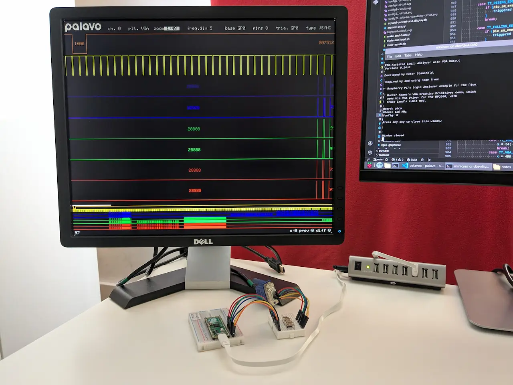

*A Raspberry Pi Pico housed in a half-sized breadboard and connected by 9 jumper wires to one side of various resistors, which are housed in a mini breadboard. On the other side of the resistors are 6 jumper wires connected to a VGA socket, which leads to a VGA monitor via a VGA cable. The monitor is displaying 8 colourful channels of captured data, namely GP0 to GP7, which are the Pico's GPIO pins responsible for generating the VGA output.*

The VGA output uses 6-bit colour (2 red, 2 green, 2 blue), has a resolution of 640x480 and uses either horizontal sync (HSYNC) and vertical sync (VSYNC), or combined sync (CSYNC).

When using the RP2350, Palavo can be configured to mirror its VGA output to DVI. I thought about changing the project name to Palavocado, but decided against it - mainly because I couldn't come up with anything for the 'c' to stand for, and because I wanted to be taken at least a little bit seriously. Also, I believe [palavo](https://en.wiktionary.org/wiki/palavo) means 'I shovelled' in Italian, and shovelling is very much what I felt I was doing when working on the source code.

Palavo can also be configured to forward logic-level VGA input signals (e.g. the VGA output signals from another Palavo device) to DVI.

The project was inspired by, and uses code from, Raspberry Pi's [Logic Analyser (Pico SDK) example](https://github.com/raspberrypi/pico-examples/tree/master/pio/logic_analyser) and their [DVI Out HSTX Encoder example for the Pico 2](https://github.com/raspberrypi/pico-examples/tree/master/hstx/dvi_out_hstx_encoder), both of which are licensed with the [BSD 3-Clause License](LICENSE-raspberry-pi). Palavo was also inspired by, and uses code from, Hunter Adams's [VGA Graphics Primitives demo](https://github.com/vha3/Hunter-Adams-RP2040-Demos/tree/master/VGA_Graphics/VGA_Graphics_Primitives), which has no license, but Hunter has kindly given me permission to share my code with the same [BSD 3-Clause License](LICENSE).

[Hunter Adams](https://vanhunteradams.com) is an Assistant Teaching Professor at Cornell University, and I can't recommend enough his excellent [ECE4760](https://ece4760.github.io/) lectures and lab assignments, as well as his students' fabulous RP2040 projects.


## How to build Palavo

There are a number of configurations, which can capture any of the 32 GPIOs of the RP2040/RP2350A, or the 48 GPIOs of the RP2350B. Pre-built binaries (`.uf2` files) are available to get up and running without the need to build any firmware.  

If you plan to build your own firmware, configurations are defined by adding the appropriate `PALAVO_CONFIG` variable to the `cmake` command line that's used to create a build directory, in which the firmware is then built. Instructions for this are detailed in each of the configurations:


## Configuration 0

__(PALAVO_CONFIG=0)__

### Hardware

At its simplest, a [Raspberry Pi Pico or Pico 2](https://www.raspberrypi.com/documentation/microcontrollers/pico-series.html) and a few components can be used:

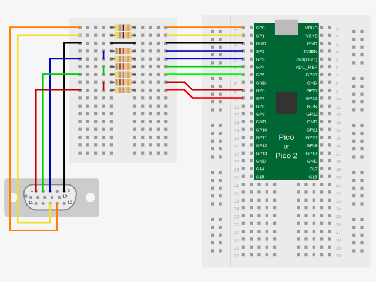

*A Raspberry Pi Pico or Pico 2 housed in a half-sized breadboard. Nine of the Pico's or Pico 2's pins are connected to one side of various resistors, which are housed in a mini breadboard. The other side of the resistors are connected to the pins of a VGA socket (or the plug on one end of a VGA cable). Here are the connections and resistor values:*

| Pico or Pico 2 Pin | Function            | Resistor | VGA Socket Pin No |
|       :---:        | :---                |  :---:   |      :---:        |
|        GP0         | VGA_Out_VSYNC       |   47R    |       14          |
|        GP1         | VGA_Out_HSYNC_CSYNC |   47R    |       13          |
|        GND         | GND                 |    0R    |        5          |
|        GP2         | VGA_Out_Dark_Blue   |    1K    |        3          |
|        GP3         | VGA_Out_Light_Blue  |   470R   |        3          |
|        GP4         | VGA_Out_Dark_Green  |    1K    |        2          |
|        GP5         | VGA_Out_Light_Green |   470R   |        2          |
|        GP6         | VGA_Out_Dark_Red    |    1K    |        1          |
|        GP7         | VGA_Out_Light_Red   |   470R   |        1          |

 Not shown in the diagram is the option to enable infra-red reception by adding 8 to PALAVO_CONFIG (when creating a build directory), and another option to enable UART comms by adding 32 to PALAVO_CONFIG . When enabled these functions use the following pins:

| Pico Pin | Function |
|  :---:   | :---     |
|   GP8    | UART_TX  |
|   GP9    | UART_RX  |
|   GP10   | IR_RX    |

Also not shown in the diagram is the abilty to use CSYNC (instead of HSYNC & VSYNC) by adding 16 to PALAVO_CONFIG. When using CSYNC, VGA_Out_VSYNC (GP0) is not used and is configured as an input. Note. Not all VGA monitors support CSYNC, but many do.

### Firmware

#### Using pre-built firmware

Place the Pico or Pico 2 in BOOTSEL mode (hold the BOOTSEL button down during board power-up or a reset) and copy the appropriate `.uf2` file onto the device:

For the Pico use [palavo_config0_on_pico.uf2](http://github.com/peterstansfeld/palavo/releases/latest/download/palavo_config0_on_pico.uf2).  
For the Pico 2 use [palavo_config0_on_pico2.uf2](http://github.com/peterstansfeld/palavo/releases/latest/download/palavo_config0_on_pico2.uf2).

Skip to [Testing Configuration 0](#testing-configuration-0).


#### Building the firmware

There may be a simpler way to build Palavo's firmware, using Raspberry Pi's Pico Visual Studio Code Extension perhaps, but I haven't experimented with that enough yet (TODO). This is how I currently build the firmware on a Raspberry Pi 5 running Raspberry Pi OS:

Follow the instructions in Appendix C: Manual toolchain setup of [Getting started with Raspberry Pi Pico-series](https://datasheets.raspberrypi.com/pico/getting-started-with-pico.pdf).

Clone this repository (palavo) to a suitable location on your PC:

```bash
git clone https://github.com/peterstansfeld/palavo.git
```

Enter the `palavo` directory:

```bash
cd palavo
```

Create a `build` directory and, enter it:

```bash
mkdir build
cd build
```

Create a directory for the board, and enter it.  

For the Pico:

```bash
mkdir pico
cd pico
```

For the Pico 2:

```bash
mkdir pico2
cd pico2
```

Create a directory for this particular configuration of Palavo, and enter it:

```bash
mkdir config0
cd config0
```

<a id="prepare-the-cmake-build-directory"></a>
Specify where the pico-sdk directory can be found on your PC, e.g.:

```bash
export PICO_SDK_PATH=~/pico/pico-sdk
```

Run `cmake` specifying where the top level CMakeLists.txt file can be found - in this case it's the great-grandparent directory `../../../`, the board `pico` or `pico2`, and the configuration `0`:  

For the Pico:

```bash
cmake ../../../ -DPICO_BOARD=pico -DPALAVO_CONFIG=0
```

For the Pico 2:

```bash
cmake ../../../ -DPICO_BOARD=pico2 -DPALAVO_CONFIG=0
```

Then build the firmware:

```bash
make
```

This should generate, among other files, a `palavo.uf2` and a`palavo.elf`.

To program the Pico or Pico 2 with `palavo.uf2` put the device into BOOTSEL mode (hold the BOOTSEL button down during board power-up or a reset) and either copy `palavo.uf2` onto the device, or use the `picotool` utility:

```bash
picotool load palavo.uf2 -f
```

To program the Pico with `palavo.elf` use `openocd` and a [Raspberry Pi Debug Probe](https://www.raspberrypi.com/documentation/microcontrollers/debug-probe.html).  


For the Pico:

```bash
openocd -f interface/cmsis-dap.cfg -f target/rp2040.cfg -c "adapter speed 5000" -c "init; reset; program palavo.elf verify reset exit"
```

For the Pico 2:

```bash
openocd -f interface/cmsis-dap.cfg -f target/rp2350.cfg -c "adapter speed 5000" -c "init; reset; program palavo.elf verify reset exit"
```

### Testing Configuration 0

If all went well, when Palavo starts you should see something like the following screen on your VGA monitor:

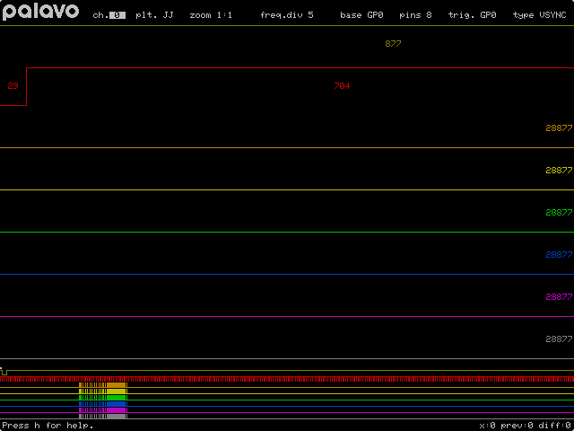

*At the top of the screen, to the right of the palavo logo, are various adjustable settings. The first setting, which is highlighted, is the selected channel (0) followed by: the colour palette used to plot each of the captured channels (JJ - standing for Jumper Jerky), the zoom level of the plots (1:1), the frequency divisor used when capturing (6), the base GPIO pin from which to capture (GP0), the number of pins to capture (8), the pin to use as a trigger pin (GP0), and the type of trigger used to start the capture (VSYNC). Below the settings and taking up most of the rest of the screen is a scrollable area filled with colourful plots of sections of each of the 8 captured channels, one below the other. Along each plot, if there is space for them, are the number of capture periods between transitions. Below this area is a minimap of the 8 channels, which is a condensed view of the whole of the captured channels scaled to fit the width of the screen. Just above the minimap is a small marker indicating which section of the minimap is being shown in the scrollable area above it. Below the minimap and at the bottom of the screen is a status bar. The left section of the status bar shows a little information, usually about the last key that was pressed; in this case it just reads "Press h for help." The right section of the status bar shows the current position of the main window "x: 0", its previous position "prev: 0", and the difference between the two "diff: 0".*

The channels captured in this screenshot are the GPIO pins used to generate the VGA signals which drive the VGA monitor, namely VSYNC, HSYNC, Dark Blue, Light Blue, Dark Green, Light Green, Dark Red and Light Red. The channels were captured before the coloured traces were drawn, so the only activity on the RGB channels is the white of the Palavo logo and the settings. If - instead of a Pico - we'd used a Pico 2 with its extra SRAM, the screenshot would also show the white of the status bar towards the end of the minimap, as well as a second pulse on VSYNC.

#### User input

Open a serial communication program on your PC. I use `minicom` with this command line:

```bash
minicom -b 115200 -w -D /dev/ttyACM0
```

(You may need to change the device - the bit after the `-D`. After minicom opens you may also need to add carriage returns with 'Ctrl-A U'.)

Press the 'h' key and something like the following help screen should appear:

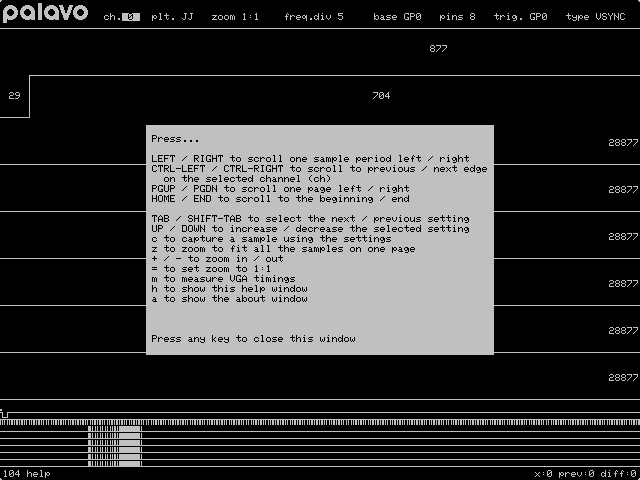

*As described in the previous image except the colourful plots in the main section and in the minimap are now white, the information section of the status bar reads "104 help", and in the centre of the screen is a white filled rectangle onto which has been drawn the following black text:*

```
HELP

LEFT / RIGHT to scroll one sample period left / right
CTRL-LEFT / CTRL-RIGHT to scroll to previous / next edge
  on the selected channel (ch)
< / > to scroll to previous / next edge but one
PGUP / PGDN to scroll one page left / right
HOME / END to scroll to the beginning / end

TAB / SHIFT-TAB to select the next / previous setting
UP / DOWN to increase / decrease the selected setting
0..9 to set the selected numeric setting
c to capture a sample using the settings
+ / - / = / z to zoom in / out / to 1:1 / to fit width
h or F1 to show this help window
a to show the about window
S to start the screensaver
CTRL-P to upload the framebuffer using xmodem

Press any key to close this window
```

Hopefully, the above instructions are clear enough to be able to get started using Palavo. If so, congratulations! I hope you find it interesting, and maybe even useful.

Note. After a period of inactivity (keyboard or infra-red) the VGA output will halt to allow the attached monitor to enter a power saving mode. Any keyboard or infra-red activity will restart the VGA output. This period of inactivity (5 minutes in the following example) can be configured by adding `-DVGA_TIMEOUT=300` to the `$ cmake` command line. To prevent the VGA output from ever being halted, except by pressing 'S' (uppercase), add `-DVGA_TIMEOUT=0`.


## Configuration 1

__(PALAVO_CONFIG=1)__

"That's all well and good", I hear you say, "but can't the Pico 2 output DVI with its RP2350's HSTX peripheral?". Well, yes it can. Try this:

### Hardware

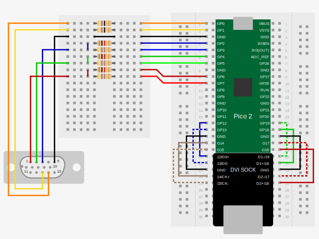

*The same circuit as used in Configuration 0 with the addition of a [Pico DVI Sock](https://github.com/Wren6991/Pico-DVI-Sock). Originally designed by Raspberry Pi's Luke Wren, Adafruit now make their own version called the [DVI Sock for Pico](https://www.adafruit.com/product/5957). The DVI Sock connects the HSTX peripheral's pins on the RP2350 to an HDMI-shaped socket allowing a DVI monitor to be used instead of, or possibly as well as, a VGA monitor. The DVI Sock is designed to be soldered or connected to the underside of the Pico 2, but is shown here housed in the same breadboard as the Pico 2 and connected to it using jumper wires:*

<a id="connecting-a-pico-2-to-a-dvi-sock"></a>

| Pico 2 Pin | DVI Sock Label |
|   :---:    |     :---:      |
|    GP12    |     12/D0+     |
|    GP13    |     13/D0-     |
|    GND     |     GND        |
|    GP14    |     14/CK+     |
|    GP15    |     15/CK-     |
|    GP16    |     16/D2+     |
|    GP17    |     17/D2-     |
|    GND     |     GND        |
|    GP18    |     18/D1+     |
|    GP19    |     19/D1-     |

Adafruit make other products that could be used instead of the DVI Sock, such as their [DVI Breakout Board](https://www.adafruit.com/product/4984) or their [PiCowBell HSTX DVI Output for Pico](https://www.adafruit.com/product/6363). ~~The PiCowBell, however, would need to have its SDA (GP4) and SCL (GP5) traces cut as they go to the Mini HDMI socket. I hope to offer another PALAVO_CONFIG option which will move the VGA Out RGB pins to GP6-GP11 so that the PiCowBell can be used without any modifications.~~ Instead of another PALAVO_CONFIG option, the custom board definition file [pico2_with_picowbell_hstx.h](boards/pico2_with_picowbell_hstx.h) is used, and its definitions take precedence over previously used ones.

### Firmware

#### Using pre-built firmware

Place the Pico 2 in BOOTSEL mode (hold the BOOTSEL button down during board power-up) and copy the [palavo_config1_on_pico2.uf2](http://github.com/peterstansfeld/palavo/releases/latest/download/palavo_config1_on_pico2.uf2) file onto the device.

If using the Pico 2 with Adafruit's PiCowBell HSTX DVI Output for Pico use [palavo_config1_on_pico2_with_picowbell_hstx.uf2](http://github.com/peterstansfeld/palavo/releases/latest/download/palavo_config1_on_pico2_with_picowbell_hstx.uf2)

Skip to [Testing Configuration 1](#testing-configuration-1).

#### Building the firmware

In the `build` directory, if a `pico2` directory doesn't already exist, create one. 

```bash
mkdir pico2
```

Enter the `pico2` directory:

```bash
cd pico2
```

Create a directory for this particular configuration of Palavo, and enter it:

```bash
mkdir config1
cd config1
```

Repeat the rest of the [previous build process](#prepare-the-cmake-build-directory), except use this `cmake` command:

```bash
cmake ../../../ -DPICO_BOARD=pico2 -DPALAVO_CONFIG=1
```

### Testing Configuration 1

If all went well, when Palavo starts you should briefly see the following test screen on your *DVI* monitor:

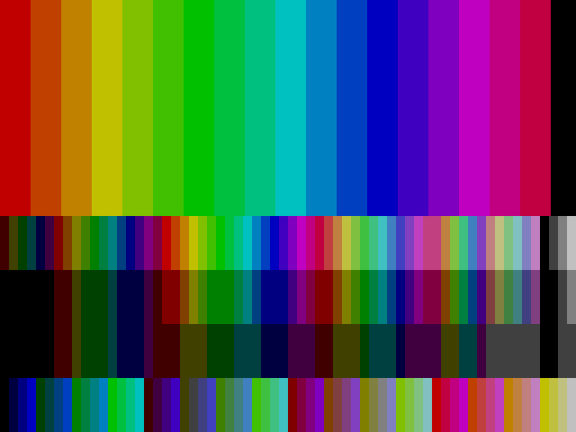

*Lots of vertical bars of various colours and lengths. The top half of the screen is made up of 19 vertical bars changing from red through the colours of the rainbow to violet, then through magenta to crimson, and finally a single black bar. The bottom half of the screen is made up of 4 rows of vertical bars of various colours with the bottom row being made up all 64 colours ranging from 0 (black) to 63 (white).*

After that, you should see a screen similar to the one on the VGA monitor in Configuration 0. If you now use the `tab` key to highlight the `pins` setting and change it from 8 to 20 with the `up-arrow` key, and then press the `c` key (for capture), you should see something like this:

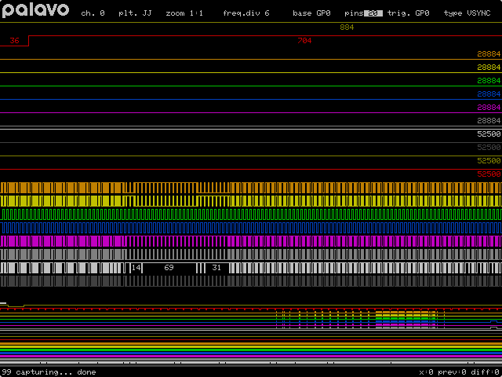

*Twenty colourful channels of captured data. The first 8 channels are the relatively quiet VGA Out signals, the next 4 channels are absolutely silent unused GPIO pins, and the last 8 channels are the extremely busy DVI output signals, showing just how much more complex DVI is compared with VGA.*

Press the 'h' key and a familiar help window should appear, only with the addition of a 'v' item:  

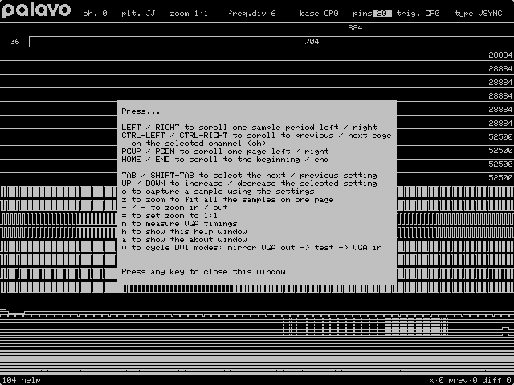

*The extra line in the help window reads `v to cycle DVI modes: mirror VGA out -> test -> VGA in`.*

In `mirror VGA out` mode, whatever is displayed on VGA_Out is also displayed on DVI. In `test` mode, the test screen is displayed on DVI. In `VGA in` mode, whatever is seen on VGA_In is displayed on DVI. However, in this particular configuration the VGA_In pins are the same as the VGA_Out pins, which I realise is a little confusing, but in other configurations VGA_In and VGA_Out don't share the same pins, and hopefully that then makes a little more sense.

### Thoughts

I find it amazing that the RP2350 can output a DVI signal without too much trouble. However, the DVI framebuffer currently uses a lot of SRAM and this reduces the amount of signal data we can capture. Also, this configuration doesn't leave many pins free to capture external signal data. We could lose the VGA output pins and gain a little SRAM by freeing up the VGA framebuffer, but if we had a spare Pico 2...


## Configuration 21

__(PALAVO_CONFIG=21)__

If we have a spare Pico 2, and change the VGA_Out\*s to VGA_In\*s we can make a 6-bit logic level VGA - DVI converter. We can also squeeze in a VGA_Out_CSYNC and a VGA_Out_RGB to provide a monochrome VGA output for testing purposes, which can also be mirrored to the DVI output.

### Hardware

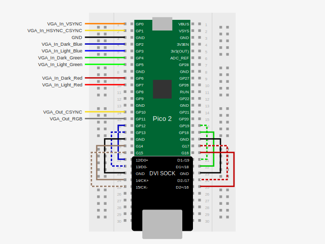

*A Raspberry Pi Pico 2 housed in a half-sized breadboard, connected to a DVI Sock ([as described in Configuration 1](#connecting-a-pico-2-to-a-dvi-sock)), and listing the following functions:*

| Pico 2 Pin | Function           |
|   :---:    | :---               |
|    GP0     | VGA_In_VSYNC       |
|    GP1     | VGA_In_HSYNC_CSYNC |
|    GND     | GND                |
|    GP2     | VGA_In_Dark_Blue   |
|    GP3     | VGA_In_Light_Blue  |
|    GP4     | VGA_In_Dark_Green  |
|    GP5     | VGA_In_Light_Green |
|    GP6     | VGA_In_Dark_Red    |
|    GP7     | VGA_In_Light_Red   |
|    GP10    | VGA_Out_CSYNC      |
|    GP11    | VGA_Out_RGB        |
 
 Not shown in the above diagram is the option to enable infra-red reception by adding 8 to PALAVO_CONFIG (when creating a build directory), and another option to enable UART comms by adding 32 to PALAVO_CONFIG. When enabled these functions use the following pins:

| Pico 2 Pin | Function |
|   :---:    | :---     |
|    GP8     | UART_TX  |
|    GP9     | UART_RX  |
|    GP28    | IR_RX    |

This Pico 2 can then sit on top of, or below, the Pico or Pico 2 in Configuration 0 with *only* the connections we need, namely all the VGA_In pins (which connect to the VGA_Out pins), and the GNDs. N.B. If this Pico 2 (Configuration 21) is not being powered by any other source, e.g. via its USB port, it can be powered by connecting its VSYS pin to the VSYS pin of the Pico or Pico 2 in Configuration 0. N.B. Do NOT power both Picos with USB (or any other power source) if their VSYS pins are connected.

### Firmware

Note. Some DVI monitors don't support the 640x480 resolution at 72 Hz, which is the refresh rate that the Pico 2 uses to output DVI when operating at its default clock frequency of 150 MHz. If your monitor doesn't support 72 Hz, there's a good chance it will support 60 Hz, and this requires us to slow the Pico 2's clock frequency to 125 MHz.

#### Using pre-built firmware

Place the Pico 2 in BOOTSEL mode (hold the BOOTSEL button down during board power-up) and copy the appropriate `.uf2` file onto the device:  
For the 72 Hz DVI refresh rate use [palavo_config21_on_pico2.uf2](http://github.com/peterstansfeld/palavo/releases/latest/download/palavo_config21_on_pico2.uf2).  
For the 60 Hz DVI refresh rate use [palavo_config21_at_125mhz_on_pico2.uf2](http://github.com/peterstansfeld/palavo/releases/latest/download/palavo_config21_at_125mhz_on_pico2.uf2).

If using the Pico 2 with Adafruit's [PiCowBell HSTX DVI Output for Pico](https://www.adafruit.com/product/6363) copy one of these files instead:  
For the 72 Hz DVI refresh rate use [palavo_config21_on_pico2_with_picowbell_hstx.uf2](http://github.com/peterstansfeld/palavo/releases/latest/download/palavo_config21_on_pico2_with_picowbell_hstx.uf2)  
For the 60 Hz DVI refresh rate use [palavo_config21_at_125mhz_on_pico2_with_picowbell_hstx.uf2](http://github.com/peterstansfeld/palavo/releases/latest/download/palavo_config21_at_125mhz_on_pico2_with_picowbell_hstx.uf2)

Skip to [Testing Configuration 21](#testing-configuration-21).

#### Building the firmware

In the `build/pico2` directory create a directory, and enter it:

```bash
mkdir config21
cd config21
```

Repeat the rest of the build process as described in the [Configuration 0 example](#prepare-the-cmake-build-directory), except use one of the following `cmake` commands:

For the 72 Hz refresh rate use:

```bash
cmake ../../../ -DPICO_BOARD=pico2 -DPALAVO_CONFIG=21
```

For the 60 Hz refresh rate use:

```bash
cmake ../../../ -DPICO_BOARD=pico2 -DPALAVO_CONFIG=21 -DSYS_CLK_HZ=125000000
```
Note. If using the Pico 2 with Adafruit's [PiCowBell HSTX DVI Output for Pico](https://www.adafruit.com/product/6363) create and enter a suitably named directory, e.g. `/build/pico2_with_picowbell_hstx/config21`, and instead of `-DPICO_BOARD=pico2` in one the above `cmake` commands`, use `-DPICO_BOARD=pico2_with_picowbell_hstx`.

### Testing Configuration 21

Something fun to do here is to get Hunter Adams's [VGA Graphics Primitives demo](https://github.com/vha3/Hunter-Adams-RP2040-Demos/tree/master/VGA_Graphics/VGA_Graphics_Primitives) running on a Pico or Pico 2, and then connect it to a Pico 2 in Configuration 21:

### Hardware

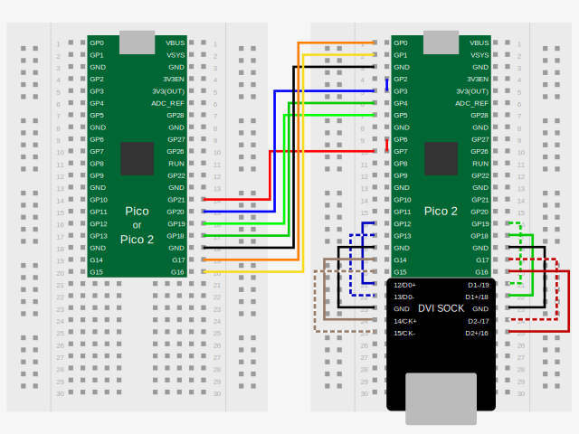

*A Raspberry Pi Pico or Pico 2 running Hunter Adams's VGA Graphics Primitives demo, which housed in a half-sized breadboard. Seven of its pins are connected to corresponding pins on a Pico 2 in Configuration 21, which is housed in another half-sized breadboard and connected to a DVI Sock ([as described in Configuration 1](#connecting-a-pico-2-to-a-dvi-sock)). Here are the connections between the Pico or Pico2 running the demo and the Pico 2:*

| Demo Pico or Pico 2 Pin | Function            | Pico 2 in Configuration 21 Pin | Function           |
|         :---:           | :---                |              :---:             | :---               |
|          GP17           | VGA_Out_VSYNC       |               GP0              | VGA_In_VSYNC       |
|          GP16           | VGA_Out_HSYNC       |               GP1              | VGA_In_HSYNC_CSYNC |
|          GND            | GND                 |               GND              | GND                |
|          GP20           | VGA_Out_Blue        |               GP2              | VGA_In_Dark_Blue   |
|          GP20           | VGA_Out_Blue        |               GP3              | VGA_In_Light_Blue  |
|          GP18           | VGA_Out_Dark_Green  |               GP4              | VGA_In_Dark_Green  |
|          GP19           | VGA_Out_Light_Green |               GP5              | VGA_In_Light_Green |
|          GP21           | VGA_Out_Red         |               GP6              | VGA_In_Dark_Red    |
|          GP21           | VGA_Out_Red         |               GP7              | VGA_In_Light_Red   |

Note. Here are the connections if using the Pico 2 with Adafruit's [PiCowBell HSTX DVI Output for Pico](https://www.adafruit.com/product/6363):

| Demo Pico or Pico 2 Pin | Function            | Pico 2 with PiCowBell HSTX in Configuration 21 Pin | Function           |
|         :---:           | :---                |                        :---:                       | :---               |
|          GP17           | VGA_Out_VSYNC       |                         GP0                        | VGA_In_VSYNC       |
|          GP16           | VGA_Out_HSYNC       |                         GP1                        | VGA_In_HSYNC_CSYNC |
|          GND            | GND                 |                         GND                        | GND                |
|          GP20           | VGA_Out_Blue        |                         GP6                        | VGA_In_Dark_Blue   |
|          GP20           | VGA_Out_Blue        |                         GP7                        | VGA_In_Light_Blue  |
|          GP18           | VGA_Out_Dark_Green  |                         GP8                        | VGA_In_Dark_Green  |
|          GP19           | VGA_Out_Light_Green |                         GP9                        | VGA_In_Light_Green |
|          GP21           | VGA_Out_Red         |                         GP10                       | VGA_In_Dark_Red    |
|          GP21           | VGA_Out_Red         |                         GP11                       | VGA_In_Light_Red   |

### Firmware

Place the Pico or Pico 2 in BOOTSEL mode (hold the BOOTSEL button down during board power-up) and copy the appropriate `.uf2` file onto the device:

For the Pico use [vga_graphics_primitives_demo_on_pico.uf2](http://github.com/peterstansfeld/palavo/releases/download/v0.14.0/vga_graphics_primitives_demo_on_pico.uf2).  
For the Pico 2 use [vga_graphics_primitives_demo_on_pico2.uf2](http://github.com/peterstansfeld/palavo/releases/download/v0.14.0/vga_graphics_primitives_demo_on_pico2.uf2).

<a id="vga-demo-screenshot-paused"></a>
Start both devices and hopefully you should see Hunter's demo on your DVI monitor:

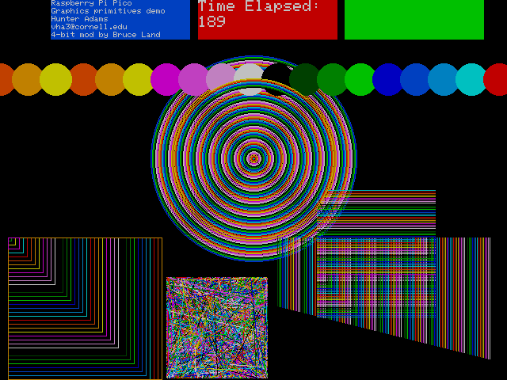

*A screenshot of various graphical primitives drawn in 15 colours on a black background. At the top of the screen are three filled rectangles: one blue, one red, and one green. Text has been drawn on five lines in the the blue rectangle, which read "Raspberry Pi Pico", "Graphics Primitives demo", "Hunter Adams", "vha@cornell.edu" and "4-bit mod by Bruce Land". The red rectangle has two lines of large text, which read "Time Elapsed:" and "189". When running this area of the screen remains static except for the number, which increments every second. Below this area are filled circles; unfilled circles; unfilled squares; and horizontal, vertical, and diagonal lines drawn on different sections of the screen, which get redrawn in various colours, locations and sizes every 20 milliseconds.*

I said it was fun.

<a id="removing-vsync-jumper-wire"></a>
Oh, and in order to obtain this screenshot I had to remove the VSYNC jumper wire because transmitting the DVI screen buffer using the [xmodem](https://en.wikipedia.org/wiki/XMODEM) protocol at 115,200 bps takes quite a long time - a good deal longer than 20 milliseconds. If you'd like to see the result of not removing the VSYNC jumper wire, take a look at [this screenshot](#vga-demo-screenshot-playing) in the [How to download a screenshot](#how-to-download-a-screenshot) section.

Before we finish with Configuration 21, if you've been wondering why Palavo uses 6-bit colour (RRGGBB) it's because when converting the VGA output to DVI, using the HSTX peripheral on the RP2350, the colours remain the same as the VGA output. This is due to each colour being made up of the same number of bits, which is not the case with Hunter's and Bruce's 4-bit colour (RGGB). To save SRAM used by Palavo's VGA driver, each horizontal line consists of a maximum of two 6-bit colours.


## Configuration 2

__(PALAVO_CONFIG=2)__

The trouble with [Configuration 0](#configuration-0) is that we're using quite a few GPIO pins for the VGA_Out signals, and optionally for UART_TX, UART_RX, and IR_RX. What if we wanted to capture 24 external inputs, say, from a keyboard's switch matrix? Well, we can't with a Pico or Pico 2, but we can with a board that uses the B variant of the RP2350. The RP2350B has 48 GPIO pins, and we only need 7 or 8 for VGA_Out, or 8 for DVI_Out. The slight inconvenience with DVI_Out (using HSTX) is that it's fixed on pins GP12-GP19, whereas with VGA_Out we can put its 7 or 8 outputs on whichever pins we like. Allow me introduce you to the [Pimoroni Pico LiPo 2 XL W](https://shop.pimoroni.com/products/pimoroni-pico-lipo-2-xl-w):

### Hardware

.")

*A Pimoroni Pico LiPo 2 XL W occupying the whole length of a half-sized breadboard. Eight of its pins are connected to corresponding pins on a Pico 2 (in Configuration 21), which is housed in another half-sized breadboard and connected to a DVI Sock ([as described in Configuration 1](#connecting-a-pico-2-to-a-dvi-sock)). Here are the connections between the Pico LiPo 2 XL W and the Pico 2:*

| Pico LiPo 2 XL W Pin | Function            | Pico 2 Pin | Function           |
|        :---:         | :---                |   :---:    | :---               |
|         GP31         | VGA_Out_CSYNC       |    GP1     | VGA_In_HSYNC_CSYNC |
|         GND          | GND                 |    GND     | GND                |
|         GP32         | VGA_Out_Dark_Blue   |    GP2     | VGA_In_Dark_Blue   |
|         GP33         | VGA_Out_Light_Blue  |    GP3     | VGA_In_Light_Blue  |
|         GP34         | VGA_Out_Dark_Green  |    GP4     | VGA_In_Dark_Green  |
|         GP35         | VGA_Out_Light_Green |    GP5     | VGA_In_Light_Green |
|         GP36         | VGA_Out_Dark_Red    |    GP6     | VGA_In_Dark_Red    |
|         GP37         | VGA_Out_Light_Red   |    GP7     | VGA_In_Light_Red   |

 Not shown in the above diagram is the option to enable infra-red reception by adding 8 to PALAVO_CONFIG (when creating a build directory), and another option to enable UART comms by adding 32 to PALAVO_CONFIG . When enabled these functions use the following pins:

| Pico LiPo 2 XL W Pin | Function |
|       :---:          | :---     |
|        GP38          | UART_TX  |
|        GP39          | UART_RX  |
|        GP46          | IR_RX    |


### Firmware

#### Using pre-built firmware

Place the Pico LiPo 2 XL W in BOOTSEL mode (hold the BOOTSEL button down during board power-up) and copy [palavo_config2_on_pimoroni_pico_lipo2xl_w_rp2350.uf2](http://github.com/peterstansfeld/palavo/releases/latest/download/palavo_config2_on_pimoroni_pico_lipo2xl_w_rp2350.uf2) onto the device.

Skip to [Testing Configuration 2](#testing-configuration-2).

#### Building the firmware

In the `build` directory create a directory for the board, and enter it:

```bash
mkdir pimoroni_pico_lipo2xl_w
cd pimoroni_pico_lipo2xl_w
```

Create a directory for this particular configuration of Palavo, and enter it:

```bash
mkdir config2
cd config2
```

Repeat the rest of the build process as described in the [Configuration 0 example](#prepare-the-cmake-build-directory), except use this `cmake` command:

```bash
cmake ../../../ -DPICO_BOARD=pimoroni_pico_lipo2xl_w_rp2350 -DPALAVO_CONFIG=2
```

Note. At the time of writing, there wasn't an official `pimoroni_pico_lipo2xl_w_rp2350.h` board definition file in the pico SDK (2.2.0), so I cobbled one together, placed it in the `boards` directory and modified `CMakeLists.txt` to look for board definition files there (as well as in the pico SDK). I'm sure an official one will be available in the future, and when that time comes it may be best to delete or rename my unofficial one and recreate the build directory.

### Testing Configuration 2

The screen should look very similar to the screen in Configuration 0, except the `base` and `trig.` settings can be set to use GP0 to GP47 (rather than GP0 to GP31).

Here is my particular use case for Configuration 2 on a Pico LiPo 2 XL W:

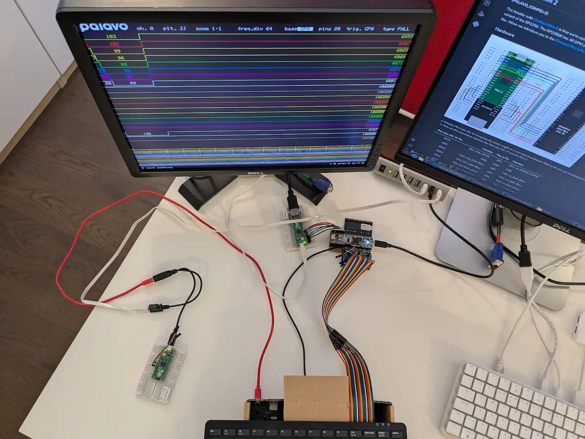

*A [Pimoroni Pico Omnibus](https://shop.pimoroni.com/products/pico-omnibus) housing two thirds of a Pimoroni Pico LiPo 2 XL W. The extra third is being housed by a piece of stripboard with two rows of double pin-header sockets, which allow the 2XL's VGA Out pins to be connected by 7 jumper wires to the VGA In pins of a Raspberry Pi Pico 2 in Configuration 21 (VGA to DVI adapter). Jumper wires from 24 of the 2XL's GPIO pins lead to the switch matrix of a disassembled [Raspberry Pi Keyboard](https://www.raspberrypi.com/products/raspberry-pi-keyboard-and-hub). The keyboard's USB cable is connected to a [keyboard to UART bridge](https://github.com/peterstansfeld/keybuart.git) as the keyboard needs to be connected to a USB host for it to be enabled, and connecting it directly to my PC caused all sorts of challenges. The DVI monitor is displaying 20 colourful channels of captured data. The first 8 channels show low pulses, as does the 18th channel, and the rest of the channels show no activity at all.*


## Configuration 40

__(PALAVO_CONFIG=40)__

What if we wanted to capture 32 contiguous channels? Unfortunately, it's not possible with the Pimoroni Pico LiPo 2 XL W because some GPIO pins are not broken out, and others are used for the on-board PSRAM and others are used for the wireless module. The answer is to use something that breaks out every GPIO pin, and the only boards which do that, that I know of, are the [Solder Party RP2350 Stamp XL](https://www.solder.party/docs/rp2350-stamp-xl/) and the [Pimoroni PGA2350](https://shop.pimoroni.com/products/pga2350). Here's the Stamp XL housed in a [Solder Party RP2xxx Stamp Carrier Basic](https://www.solder.party/docs/rp2xxx-stamp-carrier-basic/):

### Hardware

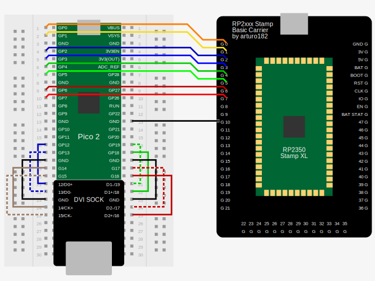

*A Solder Party RP2350 Stamp XL housed in a Solder Party RP2xxx Stamp Carrier Basic breakout board. Nine of its pins are connected to corresponding pins on a Pico 2 (in Configuration 21), which is housed in a half-sized breadboard and connected to a DVI Sock ([as described in Configuration 1](#connecting-a-pico-2-to-a-dvi-sock)). Another pin, labelled IR_RX, is configured as an infra-red receiver input. Here are the connections between the Stamp and the Pico 2:*

| RP2xxx Stamp Carrier Basic Pin | Function            | Pico 2 Pin | Function           |
|        :---:                   | :---                |   :---:    | :---               |
|         GP0                    | VGA_Out_VSYNC       |    GP0     | VGA_In_VSYNC       |
|         GP1                    | VGA_Out_CSYNC       |    GP1     | VGA_In_HSYNC_CSYNC |
|         GP2                    | VGA_Out_Dark_Blue   |    GP2     | VGA_In_Dark_Blue   |
|         GP3                    | VGA_Out_Light_Blue  |    GP3     | VGA_In_Light_Blue  |
|         GP4                    | VGA_Out_Dark_Green  |    GP4     | VGA_In_Dark_Green  |
|         GP5                    | VGA_Out_Light_Green |    GP5     | VGA_In_Light_Green |
|         GP6                    | VGA_Out_Dark_Red    |    GP6     | VGA_In_Dark_Red    |
|         GP7                    | VGA_Out_Light_Red   |    GP7     | VGA_In_Light_Red   |
|         GND                    | GND                 |    GND     | GND                |

*And here are the UART pins and the infra-red receive pin, which have been enabled by adding 32 and 8, i.e. 40, to PALAVO_CONFIG.*
 
| RP2xxx Stamp Carrier Basic Pin | Function            |
|        :---:                   | :---                |
|         GP8                    | UART_TX             |
|         GP9                    | UART_RX             |
|         GP10                   | IR_RX               |

### Firmware

#### Using pre-built firmware

Place the RP2350 Stamp XL in BOOTSEL mode (hold the BOOTSEL button down during board power-up) and copy [palavo_config40_on_solderparty_rp2350_stamp_xl.uf2](http://github.com/peterstansfeld/palavo/releases/latest/download/palavo_config40_on_solderparty_rp2350_stamp_xl.uf2) onto the device.

Skip to [Testing Configuration 40](#testing-configuration-40).

#### Building the firmware

In the `build` directory create a directory for the board, and enter it:

```bash
mkdir solderparty_rp2350_stamp_xl
cd solderparty_rp2350_stamp_xl
```

Create a directory for this particular configuration of Palavo, and enter it:

```bash
mkdir config40
cd config40
```

Repeat the rest of the build process as described in the [Configuration 0 example](#prepare-the-cmake-build-directory), except use this `cmake` command:

```bash
cmake ../../../ -DPICO_BOARD=solderparty_rp2350_stamp_xl -DPALAVO_CONFIG=40
```

### Testing Configuration 40

The screen on the DVI monitor should look the more or less the same as it does in Configuration 1, except that the `base` and `trig.` settings can be set to any value from GP0 to GP47 rather than from GP0 to GP31.

As the UART has been enabled we can control Palavo with any 3.3V logic level UART serial port, such as a suitable USB to UART bridge. I use [Raspberry Pi's Debug Probe](https://www.raspberrypi.com/documentation/microcontrollers/debug-probe.html) as it can also be used to program and debug the RP2xxx devices via their Debug interface.

Alternatively, the UART_RX pin can be connected to a USB keyboard to UART bridge, which is essentially a Pico or Pico 2 with its USB port in host mode, and which converts keyboard input to UART output. Details of the bridge can be found in this [Keybuart repository](https://github.com/peterstansfeld/keybuart.git).

The infra-red receive pin (IR_RX), along with connections to 3.3V and GND, can be connected to an infra-red receiver, e.g. this [Grove IR Receiver](https://thepihut.com/products/grove-infrared-receiver). Palavo accepts commands transmitted from this [Argon IR Remote control](https://argon40.com/products/argon-remote). This is currently an experimental feature and is limited in function, but it's a bit of fun.

Here is a Configuration 40 setup with a keyboard to UART bridge (for stand-alone use), and an infra-red remote control (for a use I've yet to come up with):

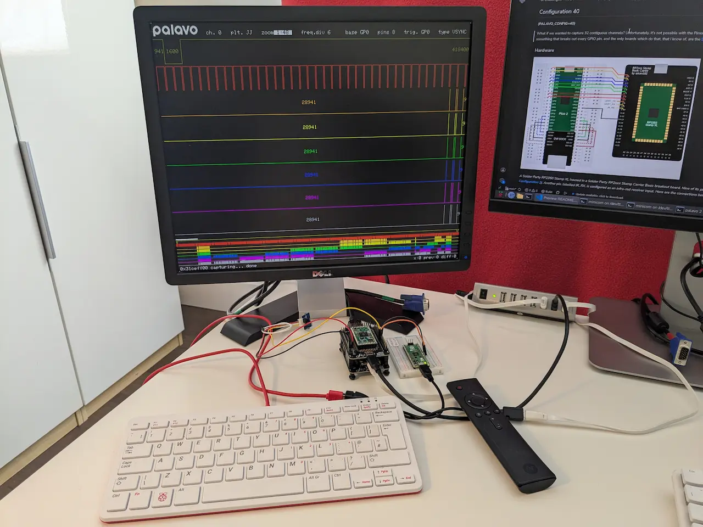

*A Solder Party RP2350 Stamp XL in Configuration 40 housed in a Solder Party RP2xxx Stamp Carrier Basic breakout board. Underneath it, connected to it and hidden from view is another Stamp Carrier Basic breakout board housing a Raspberry Pico 2 in Configuration 21 (VGA to DVI adapter) and a DVI Sock, which leads to a DVI monitor. A USB keyboard is connected to a keyboard to UART bridge and its TERMINAL_UART_TX and GND pins are connected by two jumper wires to the Stamp's UART_RXD and GND pins. More jumper wires connect the RX, VCC and GND pins from an infra-red receiver to the Stamp's IR_RX, 3.3V and GND pins. Next to the keyboard is an infra-red remote control, which was used to capture the colourful logic channels displayed on the monitor.*

That's it for the example configurations with pre-built firmware. To build other configurations it's helpful to understand PALAVO_CONFIG. 

## PALAVO_CONFIG

When we add `-DPALAVO_CONFIG=[number]` to a `$ cmake ...` command CMake passes this definition to the C compiler, which has the same effect as if we'd defined it with a `#define` in the source code, like this:

`#define PALAVO_CONFIG [number]`

To enable any of the following features, add its corresponding value to the `[number]`:

|  Bit  | #define           | Feature Description                                                   | Value |
| :---: | :---              | :---                                                                  | :---: |
|   0   | USE_DVI           | Display either VGA In, VGA Out, or a test screen to DVI.*             |   1   |
|   1   | USE_GPIO_31_47    | Use GPIO 31 to 37 instead of GPIO 0 to 7 for VGA Out.**               |   2   |
|   2   | USE_VGA_IN_TO_DVI | Display VGA In (on start-up). Needs USE_DVI to be set to make sense.* |   4   |
|   3   | USE_IR            | Enable infra-red remote control.                                      |   8   |
|   4   | USE_CSYNC         | Use CSYNC instead of VSYNC and HSYNC for VGA Out.***                  |  16   |
|   5   | USE_UART          | Use UART as well as USB for STDIO comms.                              |  32   |
 
\* Only applicable for the RP2350.  
\*\* Only applicable for the RP2350B.  
\*\*\* Automatically set if USE_GPIO_31_47 is set.  

e.g. To build a configuration that uses infra-red, enables the UART and uses CSYNC, `[number]` would need to be 8 + 32 + 16 = 56. 

## Picotool

Besides flashing a Pico or Pico2 or other RP2xxx-equipped device, Raspberry Pi's `picotool` utility is very useful for finding out what's on the device, and for finding out what's in a `.uf2` or `.elf` file before flashing it to a device.

To find out what's on the device place it in BOOTSEL mode and enter:

```bash
picotool info -a
```

To find out what's in a firmware file (e.g. palavo.uf2) enter:

```bash
picotool info -a palavo.uf2
```

## How to download a screenshot

To download a screenshot, or more accurately Palavo's VGA (or DVI) framebuffer, use a serial communication program that can receive files using the xmodem protocol. This example uses `minicom`:

Press `Ctrl-P` to tell Palavo to expect a request from minicom to transmit its framebuffer (within the next 60 seconds).  

Press `Ctrl-A`, then `R` (for Receive files), then select `xmodem` and press `Enter`.  

Choose a suitable file name (e.g. `image1.pss` ) and press `Enter`.  

After a while the file should be received and saved to the directory from where minicom was run. This example assumes that directory is `utils`.  

The received file has an unusual format and needs to be persuaded into a recognisable one for viewing. This is a two stage process. The first stage is to use a Python script in the `utils` directory called `expand-pss.py` (expand palavo screenshot) to convert our `image1.pss` to a `.rgb` file:

```bash
python3 expand-pss.py image1.pss image1.rgb
```

The second stage is to use the open-source application [ImageMagick](https://imagemagick.org/) to convert the `.rgb` image file, which is huge, to a much smaller `.png` file:

```bash
magick -size 640x480 -depth 8 image1.rgb image1.png
```

Finally, to view `image1.png`:

```bash
display image1.png
```

<a id="vga-demo-screenshot-playing"></a>
The download is slow, especially when it's the DVI framebuffer, and this is why when I first tried to take a screenshot of Hunter Adams's VGA Demo, which updates every 20 milliseconds, it ended up looking like this:

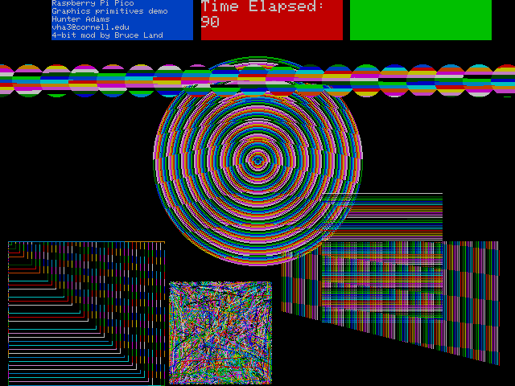

*A screenshot of various graphical primitives drawn in 15 colours on a black background. At the top of the screen are three filled rectangles: one blue, one red, and one green. Text has been drawn on five lines in the blue rectangle, which read "Raspberry Pi Pico", "Graphics Primitives demo", "Hunter Adams", "vha@cornell.edu" and "4-bit mod by Bruce Land". The red rectangle has two lines of large text, which read "Time Elapsed:" and "90". When running this area of the screen remains static except for the number, which increments every second. Below this static area is the animated area, which gets updated every 20 milliseconds. Here, the filled circles, which should each be filled with a single colour, are filled with roughly 10 horizontal blocks of various colours. Horizontal lines are generally of the same colour, the vertical lines are definitely not, and the section that should be made up of random diagonal lines looks as if [Jackson Pollock](https://en.wikipedia.org/wiki/Jackson_Pollock) was let loose with 16 paint pots full of pixels.*

Go to the [VGA Graphics Primitives demo screenshot](#vga-demo-screenshot-paused).

## Scripts
These scripts are mainly used when developing Palavo and can be found in the `utils` directory:

### expand-convert-and-display.sh

This combines the two stage process of expanding and converting a screenshot to a PNG file as described above in [How to download a screenshot](#how-to-download-a-screenshot) and adds displaying the PNG. Use with caution as files are overwritten and one is deleted during the process.

When in the `utils` directory, and with a screenshot named `image1` in the same `utils` directory:

```bash
./expand-convert-and-display.sh image1
```

This will result in `image1.png` being generated and displayed, and `image1.rgb` being overwritten then deleted.

### make-and-flash.sh

This is a simple script to be run from a `build/[board]/[config]/` directory that builds the firmware and then uses `openocd` and the Raspberry Pi Debug Probe to flash the firmware to an RP2xxx device.  

When in a `build/[board]/[config]` directory copy the script from the `utils` directory:

```bash
cp ../../../utils/make-and-flash.sh .
```

Use a text editor to open `make-and-flash.sh` and modify the `adapter_serial_no` variable to that of your Debug Probe. If you don't want or need to specify a serial number (you only have one Debug Probe connected), blank the `target_adapter_cmnd` variable.

Then `make` the firmware and flash it to an RP2xxx device:

```bash
./make-and-flash.sh
```

### make-and-load.sh

Similarly, this is a simple script to be run from a `build/[board]/[config]/` directory that builds the firmware, but then uses `picotool` to flash the firmware to an RP2xxx device.  

When in a `build/[board]/[config]` directory copy the script from the `utils` directory:

```bash
cp ../../../utils/make-and-load.sh .
```

Use a text editor to open `make-and-load.sh` and modify the long hexadecimal number following the `--ser ` part of the `picotool` command line to that of your RP2xxx-equipped device. If you don't want or need to specify a serial number (you only have one device connected), delete the `--ser ` and the long hexadecimal number that follows it.

Then `make` the firmware and flash the RP2xxx device:

```bash
./make-and-load.sh
```

To find the serial number of an RP2xxx device (including a Debug Probe, which uses an RP2040):

```bash
lsusb | grep "Raspberry Pi"
```

This should return any Raspberry Pi devices. In my case:

```bash
Bus 001 Device 002: ID 2e8a:000d Raspberry Pi USB3 HUB
Bus 001 Device 006: ID 2e8a:000c Raspberry Pi Debug Probe (CMSIS-DAP)
Bus 001 Device 007: ID 2e8a:0009 Raspberry Pi Pico
Bus 002 Device 002: ID 2e8a:000e Raspberry Pi USB3 HUB
Bus 003 Device 002: ID 2e8a:0011 Raspberry Pi Ltd Pi 500+ Keyboard (ISO)
```

Make a note of the device's `Bus` and `Device` numbers. In my case they're `001` and `007`. Then:

```bash
lsusb -s001:007 -v | grep iSerial
```

This should return the serial number (the long hexadecimal number). In my case:

```bash
  iSerial                 3 B99FD5FA9526D4F9
```

### make-assets.sh

This builds the firmware of each of the configurations mentioned in this document, and then copies and renames their `palavo.uf2` and `palavo.elf` files to the `assets` directory.

```bash
./make-assets.sh
```

### compress-rgb.py

A Python script to convert a 640x480 `.rgb` image file to a monochrome palavo screenshot `.pss` image file. I lost a screenshot, which upset me, and used this script to recreate it from a `.png` file, which wasn't lost, and which had been generated from the original screenshot (before I lost it).


## Links

 Information about VGA CSYNC (combined sync) can be found on this [HDRetrovision blog post](https://www.hdretrovision.com/blog/2019/10/10/engineering-csync-part-2-falling-short).

---

Go to the [top of this document](#palavo).
